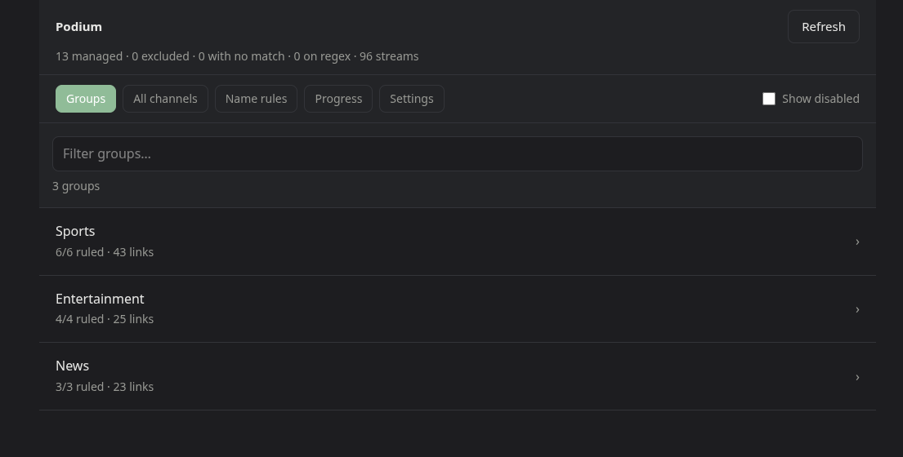

# Podium

Ranks the streams behind your [Dispatcharr](https://github.com/Dispatcharr/Dispatcharr)
channels, best first, by measuring them rather than trusting their names.

It fetches your channels and streams, works out which streams belong to which
channel, probes each one with `ffprobe`/`ffmpeg`, and writes the ranked order
back. One container, one volume.


One channel, its streams in the order Dispatcharr currently serves them, and
what each one actually is. The stream named `1080p` at #2 measures 720p; the one
named `UHD` at #5 is a black screen; #6 is dead. Matches update as you type, and
nothing is written until you say so.

## Quick start

```sh
docker run -d -p 3456:3456 -v podium-data:/app/data \
  -e DISPATCHARR_URL=http://dispatcharr:9191 \
  -e DISPATCHARR_API_KEY=... \
  ghcr.io/lpukatch/podium:latest
```

Or `docker compose up -d` with the [compose file](docker-compose.yml) in this
repo.

On first start it writes an empty rules file and comes up with nothing to check.
Open the UI on `:3456`, pick a group and start adding channels — or
[import rules you already have](docs/usage.md#importing-existing-rules).



Podium needs no credentials to boot. If you would rather not put an API key in
your environment, start it bare and enter one in **Settings**.

> [!IMPORTANT]
> **It starts in dry-run**, wherever you run it. Reordering a channel is a write
> with no undo, so Podium watches and records first. Set `PODIUM_DRY_RUN=false`
> once you have seen a few passes you agree with.

## Why it exists

Provider stream names lie. A stream advertised as `[1080p]` turns out to be
720p; one advertised as 1080p turns out to deliver 193kbps of black screen. The
only way to rank them honestly is to look.

Looking is expensive, though — every probe spends a connection you are paying
for, against a provider that will cut you off for using too many at once. Most
of Podium is about spending that budget well.

**Provider lanes, not a channel queue.** Providers have different concurrency
limits. Checking channel-by-channel means one saturated provider stalls
everything while the others sit idle, so Podium treats a *stream* as the unit of
work and gives each provider its own lane. That takes hours off a full pass on a
multi-provider catalogue.

**Caches against `stream_hash`.** Provider stream sets barely change between
runs, so most probing is repeated for nothing. Podium re-probes only when
Dispatcharr's `stream_hash` changes or the verdict ages out. (`updated_at` is
useless for this: the M3U refresh bumps it on every stream every few minutes.)

**Paces against a freshness target, not a clock.** "Every channel checked within
24 hours, using only spare provider capacity, and stopping the moment somebody
starts watching" is what you actually want. A nightly batch hammers every
provider whether or not anyone is streaming, and if it overruns it is still
going at breakfast.


All three show up on one page: each provider lane drains against its own limit,
the library tiles say how much of the catalogue is still inside the freshness
target, and channels whose EPG says the match has not kicked off yet are held
back rather than probed.

## What it measures

Resolution, bitrate, fps and codec, scored and weighted, with your own rule
order winning first. Dead streams sink to the bottom, and so do streams below a
bitrate floor or showing a black screen — a slate is not a fallback.

Bitrate is *measured*, not read from the container: live TS/HLS almost never
declares one. Podium reads a few seconds of the stream, which also gives it the
black-screen check from the same read, so it costs one provider connection
rather than two.

There is deliberately no loop detection. Catching a loop means watching for at
least one loop period — around 120s per stream against the ~1s the other checks
cost — for a failure far rarer than dead, black or throttled.

## Documentation

| guide | what is in it |
| --- | --- |
| **[Usage](docs/usage.md)** | Matching streams to channels, section qualifiers, group policy, ranking, and importing existing rules |
| **[Configuration](docs/configuration.md)** | Every environment variable, concurrency limits, and how to keep a settled install quiet |
| **[Contributing](CONTRIBUTING.md)** | Development setup, and how PRs land given the mirror |

## Development

```sh
npm install
npm run dev            # UI on :3456
npm run worker         # the paced loop
npm run test:run
```

`ffmpeg` on `PATH` matters for the tests: without it they exercise the probe
parser but not the real `ffprobe` path.

## Contributing

Issues and pull requests are welcome. Development happens on a self-hosted
Forgejo instance and **GitHub is a push mirror**, so a PR is landed by replaying
its commits upstream rather than merged on GitHub — see
[CONTRIBUTING.md](CONTRIBUTING.md) for what that means in practice.

Images: `:latest` and `:X.Y.Z` are releases; `:main` tracks the tip of `main` and
is rebuilt on every push. amd64 only for now.

## License

MIT — see [LICENSE](LICENSE).
