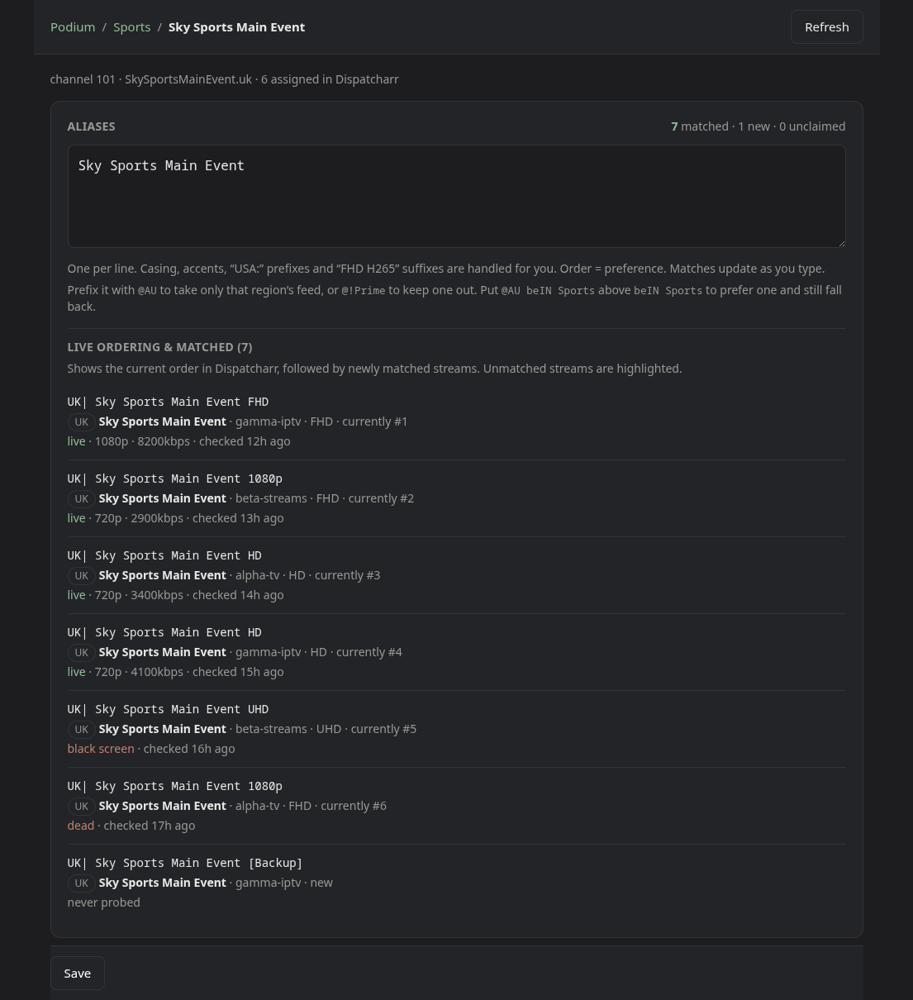
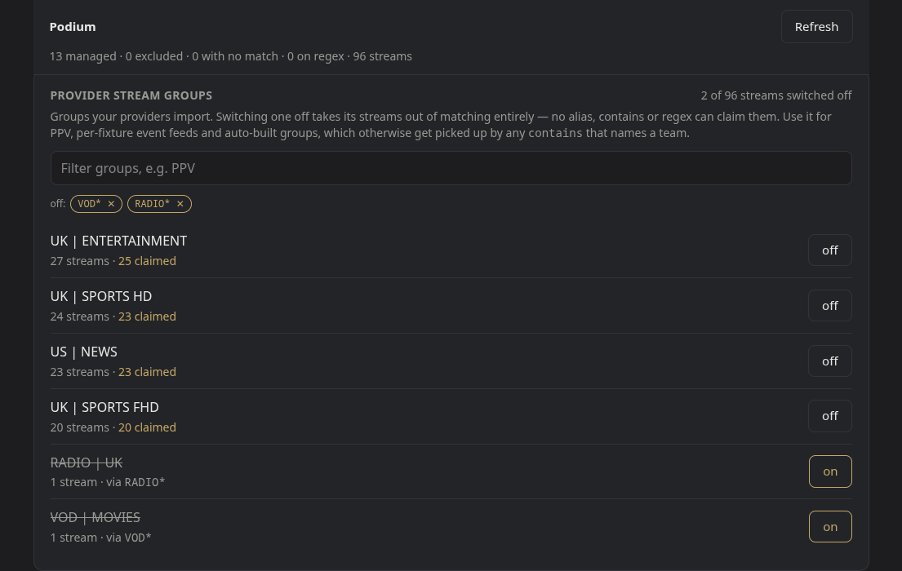
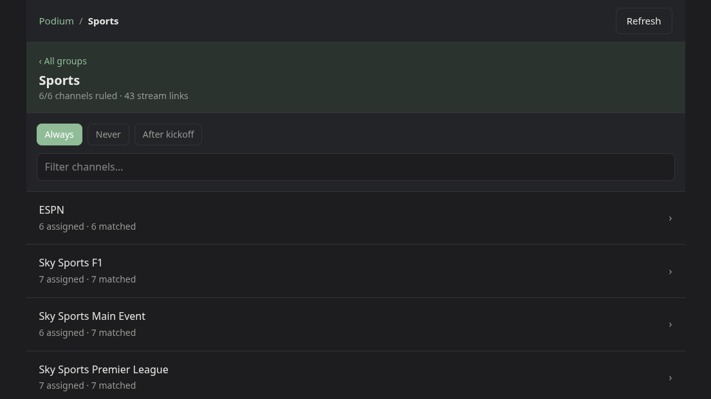
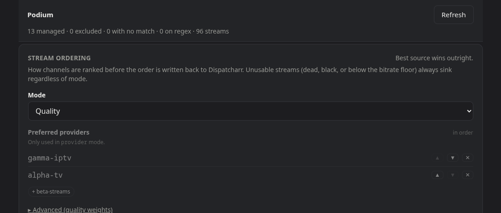

# Usage

How to tell Podium which streams belong to which channel, and what to leave
alone. For environment variables and tuning, see
[configuration.md](configuration.md).

- [Matching](#matching)
  - [Sections](#sections)
- [Groups](#groups)
  - [Provider stream groups](#provider-stream-groups)
  - [Channel groups](#channel-groups)
- [Ranking](#ranking)
- [Importing existing rules](#importing-existing-rules)

## Matching

Channels claim streams by **alias** — the plain channel name:

```
Movie Network East
```

Casing, accents, `USA:` prefixes, `FHD H265` suffixes and unicode decoration are
normalised away centrally, so an alias is just a name. Order is preference.

There are four layers, in descending order of how often you should reach for
them:

| layer | when to use it |
| --- | --- |
| **Alias** | The channel name. What you want almost always. |
| **Contains** | Whole-word substring, for a call sign buried in a longer name. Looser, and it will claim more than you expect — prefer an alias where one works. |
| **Exclude** | Reject a name — or one quality variant of it — even if an alias matches. |
| **Regex** | An escape hatch for what the first three cannot express. |

The UI shows what each rule matches *as you type*, alongside what Dispatcharr
currently has assigned, so you can see what a change would actually do. This is
the fastest way to find out that a `contains` you were about to save claims half
a category.



Each matched stream carries its last verdict — resolution, measured bitrate and
how long ago it was checked — so the cost of a rule change is visible in the
same place you make it. `new` is a stream your rules claim that Dispatcharr has
not been given yet; it stays unwritten until you save.

A stream the channel carries but no rule claims is marked `NOT MATCHED`, and has
the two answers next to it: **+ alias** claims it, **✕** takes it off the channel
in Dispatcharr. The ✕ writes immediately — it removes that one stream and leaves
the order of the rest exactly as Dispatcharr has it. Podium never assigns, so
putting one back is a job for Dispatcharr. To clear several at once, use the
tick under **Check now** instead, which removes everything the rule does not
claim as part of applying the new order.

## Sections

Normalising `AU:` and `US:` away is right until the prefix *is* the difference.
`AU: Sports Alpha` and `US: Sports Alpha` carry different events; a `FAST:` copy
of a network is usually a free ad-supported feed rather than the linear channel.
A bare alias claims all of them.

Qualify it with `@`:

```
@AU Sports Alpha           only streams whose prefix is AU
@!FAST News Central        any News Central except the FAST: ones
@US @USA Sports Alpha 1    either prefix
@"US East" News Central    quote a multi-word prefix
```

Order is still preference, so "prefer the AU feed but take any other if there
is none" is two lines:

```
@AU Sports Alpha
Sports Alpha
```

Qualifiers — `@` here, and the `~` in [Quality variants](#quality-variants) —
work on `contains` and `exclude` too. A prefix you name explicitly
beats the region denylist — `@AU Sports Alpha` matches on a channel whose
`exclude_regions` holds `AU`, since naming it is the more specific instruction.

A prefix written the old way (`Radio: Coast FM`) is still just a name: the
prefix is normalised off both sides, exactly as before. Only `@` constrains.

`@` matches the **leading words** of a prefix, or of the name when the provider
never punctuated one — which matters because the same section often appears both
ways, and only the punctuated one has a separator for `normalize` to lift. A
qualifier is a section marker, so it stops at four words: `@` is not a second
spelling of an alias.

In the UI, **Find streams** lists the prefixes each name appears under with a
count — `AU ×3` `US ×5` — and clicking one adds the qualified alias. Searching a
word that sits *inside* a name offers the section chips rather than an alias,
because an alias there would be wrong.

## Quality variants

`@` answers the question at the front of a name. The tokens providers hang off
the **back** — `4K`, `H265`, `1080p`, `RAW`, `(Event Only)` — are the same
problem at the other end, and take a trailing `~`:

```
CNN ~4K            only the UHD copy
CNN ~!4K           any CNN except the UHD copy
CNN ~1080p         exactly that height
CNN ~hevc ~60fps   both, not either
```

Those tokens are the ones `normalize` lifts off the name, which is why they need
saying separately: "US: CNN 4K" and "US: CNN" both key as `CNN`, and that is the
whole reason one alias claims every variant.

Bracketed text is addressable the same way, and often it is the only thing there
is to name:

```
FS1 ~!"event only"    every FS1 except "FS1 4K (Event Only)"
ESPN ~!multi          not the "[HEVC Multi]" copy
~"event only"         the variant, whatever it is called
```

Brackets are stripped before a name is keyed — for decoration like `[Multi]`
that is right, and it is why an `exclude` of `FS1 (Event Only)` does **not** do
what it looks like: the bracket goes, the line means `FS1`, and the channel
matches nothing at all. Write the bracket as a `~` qualifier instead. A bracket
is matched whole *and* by word, because providers pack several tokens into one.

Unlike the quality words, bracket text is **not** in the bare vocabulary — an
`exclude` line of `Event Only` is a name and stays a name. A quality token can
never collide with a name (normalisation has already removed every one of them
from every name); bracket text has no such guarantee, so it takes an explicit
`~`. A qualifier may stand alone on the line, which is what makes the third
example above legal.

The marker is different from `@` on purpose, and sits where the thing it names
sits. `@` is the section in front, `~` is the token behind — so `@HD Sports`
still means the `HD:` section and nothing in an existing rules file changes
meaning.

Both ends combine, which is how one line says "that section's copy of that
variant, and nothing else":

```
@AU CNN ~4K        the AU section's 4K copy
```

Line order is still preference, so a qualified line above an unqualified one is
a fallback rather than a hard selection — `@AU CNN ~4K` above `CNN` takes the AU
4K copy where there is one and anything else where there is not. Reach for that
when a variant is *better*; most quality rules are the plain kind above, where a
variant should simply never be picked.

A resolution word means its **tier**, not the literal token: `4K` covers `UHD`
and `2160p`, because they are one feed described three ways. Write the height
(`~2160p`) when the exact number is the point.

Stacked `~` qualifiers are **all of**, where stacked `@` qualifiers are any of.
That follows from what each names: a stream sits in one section spelled several
ways, so `@US @USA` is one question with two acceptable answers; a stream carries
tier, codec and fps at once, so `~4K ~hevc` is two questions.

`exclude` reads the same tokens, and a bare one is the short way to say it for a
whole channel:

```
4K                 drop the UHD copy, whatever it is called
@US 4K             ...in the US section only
@US CNN ~4K        ...only that name, only that section
```

All of this is rejection and selection, not ranking. If you would take the 4K
feed but rank it below the others, that is [ordering](configuration.md), which
already sorts on measured resolution — reach for these when the variant should
never be selected at all, usually because it is bandwidth you are not going to
spend.

## Groups

Dispatcharr keeps one group list for two different things, and Podium treats
them separately: **channel groups** decide what gets probed, **provider stream
groups** decide what is a candidate at all.

### Provider stream groups

You turn groups on per provider in Dispatcharr, and a subscription enabled for
its sports channels also brings in what sits next to them: per-fixture event
feeds, auto-built groups, VOD dumps. Those streams are candidates for every rule
in the file, and a loose `contains` picks them up — a per-fixture feed named
after both teams is something a team channel will happily claim, and it is dead
by morning.

Switch the group off instead:

```json
"defaults": { "exclude_groups": ["PPV EVENTS", "Auto | *"] }
```

Its streams leave matching entirely — no alias, `contains` or leftover regex
reaches them. Names, with `*`/`?` globs, rather than ids: providers churn their
M3U and Dispatcharr rebuilds the groups, so an id list quietly lets them back
in. This is the same reason the channel-side policy grew `Auto | *`.

**Settings → Provider stream groups** lists the groups your providers actually
import, how many streams each holds and how many are currently claimed —
claimed first, since a group nothing matches is not worth reading — with a
toggle per group.



A group switched off by a glob is struck through and says which pattern caught
it, so an `exclude_groups` entry that is quietly claiming more than you meant is
visible rather than inferred.

### Channel groups

Policy is per Dispatcharr channel group:

| mode | behaviour |
| --- | --- |
| `always` | check the group's **ruled** channels on the normal freshness schedule (default) |
| `never` | never probe; leave the ordering alone |
| `after_epg_start` | rule or not, but only once the channel's EPG programme has started |
| `assigned` | rule or not, on the normal freshness schedule |

Any of them can carry `measure_only`, which probes the group without ever
writing to it — see [Measure only](#measure-only-channels-another-app-owns).

The policy says *when* a channel is checked. What decides whether it is checked
at all is having a rule: under `always` — which is also what a group you have
never touched resolves to — a channel with no alias is not podium's to look at,
so a fresh install with an empty rules file checks nothing whatever its groups
say. The other two modes lift exactly that condition, which is the difference
worth reading the rest of this section for.

`after_epg_start` exists for event channels. A channel carrying a 2pm first
pitch is genuinely dead at 1pm — probing it then records a dead stream, sinks it
in the ranking, and the next person to tune in at 2:05 gets the worst stream on
the channel.

It waits for a programme the EPG marks **live**, not merely for one to be
airing. Event EPGs do not leave a channel blank until kickoff; they fill the gap
with a countdown block —

```
16:00Z–17:05Z  "Coming up: Minor League Baseball at 1:05 PM EDT"   is_live false
```

— whose start is the moment the countdown began, hours before first pitch. Gate
on that and the group is open all day, which is the opposite of what the mode is
for. Postgame blocks are the same problem afterwards.

If your EPG never marks anything live, every channel in the group is held back
with the reason `no live programme`, shown in the pass tally on the dashboard.
Set `require_live` to `false` on that group in `rules.json` to fall back to
gating on the programme's start alone:

```json
"groups": { "3618": { "mode": "after_epg_start", "require_live": false } }
```

It works the same way on a name pattern, alongside `grace_minutes` and
`window_minutes`.

Name patterns like `Auto | *` apply a policy to groups that do not exist yet,
which matters because Dispatcharr creates groups on its own.

`after_epg_start` and `assigned` are the two policies that cover channels with
no rule at all, by taking the channel's own assignment as the rule. Channels
created by another app — a scheduler that spawns one per fixture — have streams
assigned but nothing in the rules file naming them, so under `always` podium
leaves them alone; in one of these groups it ranks what the channel already
carries instead. `assigned` is that bargain for a lineup you have already built
by hand: point it at a group and podium keeps the order of every channel in it
honest without your writing a single alias. It still only reorders, never
assigns, and streams in a provider group you excluded stay out. Such a channel
shows as `assigned only` in the channel list.

An alias is still worth adding on top, per channel, where the order is not
purely a question of measurement: alias order is preference, and `exclude`
keeps a variant out of the ranking altogether. Rank-by-assignment has neither —
every stream on the channel is a candidate, scored on what it measures.



The policy is the row of chips at the top of a group. `assigned` is what
Dispatcharr has on the channel now; `matched` is what your rules claim — the two
differing is how you spot a stream the provider has just added.

#### Measure only (channels another app owns)

A fixture channel created by Teamarr carries its own idea of stream order and
rewrites it on its own schedule. A reorder written from Podium is overwritten,
which makes the two applications take turns clobbering the field a viewer
actually reads — and Podium loses that race by design.

What is worth having from those channels is the *measurement*. Probed after
kickoff, while nobody is watching, they are the only source of what the right
order would have been, which is what the quality priors are fitted from and what
the exported rules hand back to the app that owns the channel.

Toggling **Measure only** on a group — or `"measure_only": true` in
`rules.json` / `rules.yml`, on a group or a name pattern — keeps everything
except the writes:

| still happens | suppressed |
| --- | --- |
| the probe, at the time the policy says | writing the stream order |
| the cached verdict and its TTL | assigning a matched stream to the channel |
| the quality sample the priors are fitted from | |
| `stream_stats` published to Dispatcharr | |

Auto-assignment is suppressed with the reorder, and deliberately so: adding a
stream to a channel another app curates is the more intrusive of the two writes,
not the lesser.

It is orthogonal to the mode, so the natural setting for a Teamarr install is
both at once — probe once the fixture is under way, and never write:

```json
"group_patterns": [
  { "pattern": "Auto | *", "mode": "after_epg_start", "measure_only": true }
]
```

Channels handled this way are counted as `measured only` in the pass line on the
dashboard rather than folded into `already in order`, which means something
else — that the channel was checked and found correct. These were ranked and the
ranking was withheld.

#### Audio only (Radio & Music groups)

Channels carrying radio stations, Sirius XM, or music feeds have audio tracks but no video stream. By default, Podium expects video streams and treats video-less feeds as dead, black-screened, or sub-floor.

Toggling **Audio only** on a group (or adding `"audio_only": true` in `rules.json` / `rules.yml` or group name patterns) tells Podium to:
- Accept streams with valid audio tracks as healthy (`alive: true`).
- Skip video black-screen detection during probing to prevent stream mapping errors.
- Bypass the video bitrate floor (e.g. 500kbps) while still validating audio channel counts and audio bitrates.
- Score and rank streams by audio quality (channel count, codec, sample rate, and audio bitrate).
- Auto-assign matched radio streams to radio channels normally.

## Re-checking on demand

The freshness target is a floor, not a schedule. "Nothing older than 24 hours"
is satisfied by a library measured at four this morning, which is not the same
as being ready for something that is on tonight — and the streams a provider
swaps out during the day are exactly the ones you find out about at kickoff.

Two buttons say "look again anyway":

| where | scope |
| --- | --- |
| a group's page | every stream on every channel in that group |
| **Progress** | the whole catalogue |

Both **queue** work rather than doing it. They write a single timestamp, and the
planner then treats every verdict older than it as expired, so the next pass
picks the streams up through the ordinary machinery: provider lanes at their own
limits, the pass yielding the moment somebody starts watching, and event
channels still held until their programme has actually started. Nothing about a
re-check bypasses any of that — it only stops the cache answering for those
streams.

The worker notices within 30 seconds, even from the middle of an idle sleep.

Cancelling is free. Nothing was deleted from the cache to queue the work, so
dropping the request puts the existing verdicts straight back into service, and
whatever was already re-probed stays re-probed.

Two things to know before queueing the whole catalogue:

- On a large install this is hours of probing, and the day you most want it —
  a house full of people with the TV on — is the day it spends most of its time
  paused for viewers. Queue it in the morning, not at half past five. If one
  long session keeps stopping everything, **Keep probing providers nobody is
  watching** in Settings narrows the pause to the account being streamed from;
  see [configuration](configuration.md#when-one-viewer-stops-everything).
- Event channels are the ones a morning re-check helps least. A channel in an
  `after_epg_start` group is held back until its programme is live whether or
  not you asked, which is the whole point of the mode: probing a feed that is
  not up yet records a dead stream and sinks it. For those, queueing the group
  an hour or two before kickoff is worth more than queueing everything at nine.

For a single channel, the **Check now** panel on the channel itself is faster
still — it probes on the spot and shows the ordering the results imply without
writing anything. To probe all channels in a group immediately on demand, use
the **Probe all** button on the group view.

## Ranking

Step order first (an alias you put first wins), then a weighted score:
resolution, bitrate, fps, codec, audio. Dead streams sink to the bottom, and so
do streams below `PODIUM_MIN_BITRATE_KBPS` or showing a black screen — a slate
is not a fallback. The weights are normalised by their total, so only their size
relative to each other matters.

Audio earns its weight where a provider carries the same channel twice, once
with 5.1 and once without. Podium reads the richest audio track a stream has —
channel count first, the track's own bitrate to separate ties — and a new
install starts that weight at 0.1: enough to decide between feeds whose video
already ties, never enough to promote a 720p stream over a 1080p one on the
strength of its soundtrack. An install that predates the setting keeps it at 0,
so upgrading never reshuffles a lineup nobody asked to change; raise it in
**Settings → Stream ordering** to opt in.

A channel whose 5.1 only appears during live coverage will change position
between passes. That is the measurement being honest about a stream that
genuinely changed.

Bitrate is *measured*, not read from the container: live TS/HLS almost never
declares one. Podium reads a few seconds of the stream, which also gives it the
black-screen check from the same read, so it costs one provider connection
rather than two.

### Bitrate is not comparable across codecs

HEVC delivers the same picture at a fraction of the bitrate, so comparing the
two numbers directly under-ranks it. The **Prefer H.265** checkbox cannot fix
that on its own: it adds a flat bonus, while the advantage it is paying for
scales with the bitrate itself. At the default weights the bonus is worth 0.05,
where being encoded at half the rate costs 0.15 — so the better-encoded stream
loses by 0.10 and stays there.

Two fields under **Settings → Stream ordering → Advanced** handle this.

| Field | New installs | Upgrades | What it does |
| --- | --- | --- | --- |
| **HEVC bitrate factor** | `1.6` | `1` | what one kbps of HEVC is worth in H.264 kbps when the bitrate is scored |
| **UHD full-marks bitrate** | `24000` | `12000` | the bitrate that scores full marks above 1080p |

At `1.6` a 5600kbps HEVC feed is scored as the equal of a 9000kbps H.264 one,
which is the comparison the bitrate term was always meant to be making. The
figure is deliberately below the 2× the codec's headline efficiency claim would
suggest: what providers ship is a transcode rather than a tuned encode, and
overstating it promotes thin HEVC feeds over healthy H.264 ones. Across the 85
channels on one install that carry both codecs, HEVC takes the top slot on 24 of
them at `1`, 32 at `1.6`, and 47 at `2` — and by `2` feeds are winning at half
the effective bitrate of what they displace.

Setting the factor above 1 also stops **Prefer H.265** adding a bonus of its
own, because the efficiency is then already priced into the bitrate and paying
for it twice overturns real bitrate deficits. The codec weight still does its
other job: sinking mpeg2video and anything else that is neither codec.

The second field exists because the ceiling that suits 1080p starves four times
the pixels. On one live install 18 of 25 4K streams sat at or above 12000kbps,
so every one scored a flat 1.0 and the bitrate term could no longer tell a
13Mbps UHD feed from a 20Mbps one — six channels had two or more streams tied
that way. Raising it only above 1080p leaves the 1080p population, which is most
of every catalogue, exactly where it was.

Both default to inert values on an existing install, for the same reason the
audio weight does: upgrading must not reshuffle a lineup nobody asked to change.
Turning them on will move channels — on the install they were measured against,
the top slot changed on 10 of 413 channels, every one of them a channel carrying
both codecs.

**Extra logins on one provider add capacity.** A Dispatcharr M3U account can
carry several profiles — separate logins to the same upstream, each with its own
connection cap. Podium treats them as a pool. Each login gets its own lane at
its own cap, and every stream is drawn by *one* of them (rewriting the URL with
that profile's pattern, exactly as Dispatcharr does at playback), so a login
capped at 3 beside one capped at 2 gets through the catalogue five streams at a
time without either exceeding its limit. The split follows the free slots each
login has left, so a login busy with people watching TV draws proportionally
fewer. Nothing to configure; it turns itself on when a second profile appears
on the account.

The verdict is cached against the stream, not against the login that fetched
it, because the logins reach the same upstream and a probe through any of them
measures the same stream. Probing every stream through every login instead —
which is what Podium did when profile support first landed — was measured on a
live install at 2134 probes for 1067 streams, with 98 streams checked on both
logins returning 98 identical verdicts: it made the provider's sweep *slower*
than it had been on one login, because capacity rose 1.67× while the work
doubled.

A few details are worth knowing. The default profile's own search and replace
are applied as well, not assumed to be the identity pair Dispatcharr creates it
with — so a default profile edited to swap a LAN address for a WAN one is
probed at the address it actually plays. Patterns may be written in either the
JavaScript style (`$1`, `$<name>`) or the Python one (`\1`, `\g<name>`,
`(?P<name>...)`), since Dispatcharr accepts both.

Xtream Codes accounts work differently under the hood, and Podium follows them
there. Dispatcharr never rewrites the stored URL on an XC account: it applies
the profile's pattern to a canonical `server/live/user/pass/…` address, reads
the username and password back out *by position*, and rebuilds the URL around
them. Two consequences follow. A pattern that renames the `live` segment is
undone, because the rebuild writes that segment back. And a pattern that leaves
the address no longer parsable as `…/user/pass/file` — or that fills in only
one half of the search/replace pair — is abandoned altogether, with the
account's own credentials played instead. Podium reproduces both, so it never
spends a connection probing an address Dispatcharr would not play. The one gap
left is credential rotation: Podium transforms the stored URL, so if an
account's credentials change without an M3U refresh it probes the old ones
until the next sync.

A login whose pattern does not compile, or that rewrites onto a URL another
login already covers, contributes no lane and is skipped with a line in the
worker log naming it — check there first if a second login does not seem to be
adding any capacity. Skipping it is the safe reading: a login that reaches the
same URL as another is the same credentials twice, not a second line, and
drawing on it would put more connections against that line than it allows.

There is deliberately no loop detection. Catching a loop means watching for at
least one loop period — around 120s per stream against the ~1s the other checks
cost — for a failure far rarer than dead, black or throttled.



Mode and weights live in **Settings → Stream ordering**. Preferred providers
only apply in `provider` mode; in `quality` mode the best measured source wins
outright, whoever carries it.

## Exporting what Podium learned

Podium ranks a stream by measuring it. Some streams cannot be measured in time
to be useful: an event channel's streams are created for one fixture and gone
by morning, so by the time a probe would tell you anything the game has
started, and the verdict is swept with the stream the next time the catalogue
is fetched. Probing harder does not help. There is no *before* to probe in.

What outlives the fixture is where the stream came from. Podium keeps a running
record of every verdict against the provider account the stream arrived on and
the quality token in its name — `FHD`, `1080p`, `HD`, `4K` — and after a few
weeks of ordinary passes that record says something useful about a stream
nobody has ever probed: *streams like this one, from this account, measure
about 6800kbps and are dead one time in twenty.*

Nothing about this changes how Podium probes. The record is a byproduct of
verdicts already being produced, so it costs no extra provider connections, and
it accumulates in dry-run exactly as it does live.

### What it learns from

A rule exported from this is evaluated behind a fixture channel, at kickoff. A
catalogue is mostly not that — VOD dumps, 24/7 filler, entertainment packages —
so learning from all of it measures the wrong population twice over: the
baseline every exported number is quoted against becomes a film library's
bitrate, and an account's effect becomes a claim about its movie encoder.

**Settings → Quality priors** decides which probes count. Two signals, and an
`exclude` that vetoes both:

| Setting | What it does |
| --- | --- |
| **Learn only from event channels** | Counts a probe only when the channel it was run for sits in a group set to `after_epg_start` or `assigned` — the groups you already declared are events under [Channel groups](#channel-groups). On by default. |
| **Always learn from groups matching** | Globs — `* SPORT*, *PPV*` — matched against the provider group *and* the channel group. Admits a group whatever its policy says. |
| **Never learn from groups matching** | Globs — `*VOD*, *MOVIE*, *24/7*` — that drop a sample however it was admitted. |

Every sample is still recorded, whatever the scope says. The gate applies when
the profile is *built*, so narrowing it costs nothing permanent and widening it
takes effect immediately rather than after another month of probing. The
Quality tab reports what the scope dropped and why, and **Ignore the scope**
shows the ungated profile for comparison without saving anything.

One transitional case worth knowing about: samples recorded before this
existed carry no channel and no policy, so under **Learn only from event
channels** they cannot be judged and are reported as *probed before the scope
was recorded* rather than silently dropped. Naming their groups under **Always
learn from groups matching** puts them back in scope today; otherwise new
passes replace them over the following weeks.

### The profile

    GET /api/quality-profile

Returns every bucket Podium has samples for — how many, how often they were
alive, how often black, the median and p90 of the bitrates it actually
measured — along with the per-account and per-tier effects derived from them.
`?minSamples=` sets how many samples a bucket needs before it is allowed to
contribute an effect; the default is 20, because a reading off four streams is
noise with a number attached.

The response describes the scoped population: `totalSamples` is what the fit
read, `recordedSamples` is everything held, `namedSamples` is how many carry the
stream's name — kept for mining name patterns later, so it reads as zero on
history recorded before names were — and `scope` carries the rules in
force and a count per reason a sample was left out. `?eventOnly=0`,
`?include=` and `?exclude=` override the configured scope for one request —
`?eventOnly=0&include=&exclude=` is the ungated profile — which is how to ask
what a change would do before making it.

Bitrate percentiles use only bitrates that were *read*, on streams that were
alive and not black. A container's declared bitrate, a dead stream's zero and a
slate's 300kbps all describe something other than what a viewer receives; how
often those happen is carried separately, as the alive and black rates.

### As Teamarr rules

    GET /api/quality-profile?format=teamarr

Returns a `stream-ordering-rules.json` that [Teamarr](https://github.com/pharaoh-labs/teamarr)'s
**Channels → Stream Priority → Import** accepts as-is: one scoring rule per
provider account, one per provider group and one per quality tier, each
carrying that dimension's measured distance from your install's baseline.
Teamarr sums the rules a stream matches, so a good account, a good group and an
`FHD` token add up — no probe on Teamarr's side, and the ordering applies to a
stream the moment it appears.

Those three are **priors**: statements about where a stream came from, which is
all that can be said about one nobody has probed. They split the way Teamarr's
matcher does — `m3u` and `group` are wholesale, a stream either came from that
account or that group, while `regex` is the only one that reads the stream's
own name.

The export also writes `stats_metric` rules, and those are not priors at all.
They read the `stream_stats` Podium publishes to Dispatcharr, so they score a
measurement of *the stream in front of you*. Three kinds:

```
alive|=|0                      -100
blank_detected|=|1             -100
ffmpeg_output_bitrate|<|6602     -8    <- your p50
ffmpeg_output_bitrate|>=|8047    +8    <- your p75
ffmpeg_output_bitrate|>=|9444    +8    <- your p90
```

The two liveness rules are the ones that matter most, because no prior can
express them. Provenance does not predict whether a stream is up right now, so
without them a rule set ranks a dead stream from a good account above a working
one from a mediocre account — measured on a live install, that was 27 of 61
disagreements, and 20 channels leading with a dead or black stream while a
working one sat below it.

They demote only. Nothing rewards a stream for being alive: a stream Podium has
never probed carries no `alive` key at all, so neither rule fires and it scores
its priors and nothing else — the right answer when nobody has looked at it. A
positive rule would instead push every unprobed stream below every probed one,
and at kickoff the unprobed streams are most of them.

The **bitrate ladder is read off your own catalogue**, at the median, upper
quartile and top decile of your watchable streams. Hand-picked thresholds go
stale invisibly: a rule set found in the field carried rungs at 10000 and 15000
kbps against a catalogue whose median watchable stream measured 6602, so the
first cleared 5.7% of streams and the second 0.4%. Both looked exactly like
rules that worked. Dead and black streams are excluded from the percentiles —
they are the liveness rules' business, and leaving them in drags every rung
toward zero until the bottom one is cleared by a black screen.

The ladder is **centred on the median**, and that is the part worth
understanding. Teamarr's `stats_metric` matcher does not fire on a stream with
no `stream_stats` at all — absent stats are not read as zero, they are read as
no match — so a ladder made only of promotions scores every unprobed stream 0
and every probed one above it. That ranks *having been probed*, not being any
good, and on event inventory the two are nothing like the same thing: the
streams Podium has measured are the ones that sat still long enough to measure,
which skews hard toward the long-lived linear feeds Teamarr attaches by EPG
match and away from the per-event streams that appear an hour before kickoff. A
bitrate rule built that way is an `epg_match` bonus wearing a bitrate's name.

So the bottom step is a **demotion below the median** rather than a promotion
above it. A stream measured worse than your field loses points, one measured
better gains them, and 0 — the score of a stream nobody has probed — lands level
with a median stream. The span is unchanged; where zero sits in it is not.

On a catalogue uniform enough that p50, p75 and p90 collapse onto one number,
the promotions are **dropped rather than de-duplicated**: a `>=` at the median
fires on everything the demotion did not catch, which is a flat bonus for having
been probed, and reintroduces exactly what centring the ladder removed. What
ships is the demotion alone.

`?deadPoints=` and `?bitratePoints=` tune the two; set either to `0` to
suppress it.

### Pushing straight to Teamarr

Set **Teamarr URL** in Settings — `http://teamarr:9195` on the same cluster —
and the four-step file shuffle collapses into one button on the Quality page.
Podium reads the rules Teamarr is running, merges its own in exactly as the file
route does, and writes the result back.

The reason that is safe to do unattended is not the HTTP call. It is that Podium
can already answer the question an automatic write has to answer first: *would
this make the ordering worse?* Every push scores both rule sets — the one
Teamarr is running and the one about to replace it — against the measurements,
over the same channels in the same pass, and **refuses on a regression**:

- any rise in channels led by a dead or black stream, or
- fewer channels agreeing with the measurements **and** more measured bitrate
  given up.

The first can veto on its own, even where agreement improves. A channel led by
a dead stream is not a rounding error in a percentage.

The second is a conjunction on purpose. Agreement counts channels, and channels
are not equally wrong: a disagreement is recorded whenever the rules' first pick
is not the measurements' first pick, *including* where the two streams are
indistinguishable — which on a real catalogue is the common case, because the
near-duplicates a channel carries are usually the same broadcast from two
providers. On a live install, six channels flipped to disagreeing and three of
them had the rules picking a stream of equal or **higher** bitrate, with two
more differing by about 10 kbps out of seven megabits. Counting those as a
regression refuses a push that is, by the only measure a viewer notices,
slightly better. The bitrate given up supplies the magnitude the count throws
away, so both have to move the wrong way.

Bitrate alone still gates nothing. A set that gives up more while agreeing at
least as often has moved streams the measurements do not rank — the operator's
call, not a refusal.

Ties pass, because a set that changes nothing measurable still carries fresher
numbers and an install with a stable catalogue would otherwise never update.

**Preview a push** runs every one of those checks and reports what would happen
without writing — the only honest way to ask what tonight's scheduled push would
do. The panel also carries a **Last sync … · next …** line, so a schedule that
has quietly stopped running is visible without reading a log.

**Test connection**, in Settings beside the Teamarr URL, answers the question a
push can only answer by attempting one. It reports the rule count and the type
breakdown rather than a bare "connected", because anything can answer 200 and
what matters is whether *Teamarr's* rules API did — and where Podium has pushed
before, it compares what is live against what it last sent:

- *Exactly what Podium pushed on …* — the write landed and is still there.
- *Podium has not pushed here yet* — the normal state before the first push.
- *2 rule(s) Podium did not push, 1 rule(s) Podium pushed are gone* — somebody
  has edited the rules in Teamarr since. Not an error, but worth knowing before
  pushing again, since the merge will fold those edits in.

A rule's points are part of its identity for that comparison, so a rule retuned
by hand reads as one rule gone and one added rather than as no change. A set
containing the same rules in a different order is reported as exactly that: for
scoring rules order is cosmetic, but the first *priority* rule a stream matches
sets its band, so a reordered set is not provably the same ordering.

Two more guards sit in front of the comparison. Nothing is pushed until the
profile is fitted on at least **Fewest samples to push from** in-scope samples
(200 by default): a few hours of samples still fit confident-looking rules, and
this is what stops a database cleared overnight becoming a whole catalogue's
ordering by morning. And the merged set is validated against the shape Teamarr's
own importer enforces before it is sent, because a `PUT` Teamarr rejects halfway
is not a no-op.

**Push on a schedule** runs the same thing on an interval, daily by default. It
is off until you turn it on, and the button is unaffected either way. Due-ness is
measured from the last *attempt*, not the last successful push — a refusal is a
completed decision, and retrying it every 30 seconds would fetch a catalogue each
time to reach the same conclusion.

What the last push did, refusals included, is on the Quality page. That matters
more than it sounds: a declined push leaves Teamarr byte-identical, so without
the record there is no way to tell a scheduled sync that ran and chose not to act
from one that never ran at all.

### Which dimension gets the credit

The three factors are estimated broadest first — account, then group, then
tier — and that order is a decision, not an accident of declaration.

Backfitting cannot split factors that move together, and on a real install they
move together almost completely: of 121 provider groups measured on one,
**exactly 2 appeared under more than one account**. A group is a provider's own
way of organising what it sells, so it is nested inside the account by
construction, and a tier token turns out to be nested too when only one account
writes them. With collinear factors every split that sums to the same total
predicts identically, so the fit cannot choose between them — whichever is
estimated first absorbs the shared signal and the rest re-centre to zero.

That made the order decisive, and the original order put the tier first. An
account whose streams answered 54% of the time against 85% had its −2937kbps
land on `fhd`; its four accounts all read exactly `0`; and the export withheld
the tier rule as confounded. The signal was real and in the wrong column — and
`m3u` rules, which Teamarr supports and most hand-written rule sets use, could
never be generated at all.

Broad to narrow fixes it for two reasons. It **generalises**: a group that has
not been measured yet still inherits its account's average, where the reverse
order gives it nothing. And it **exports correctly** — a `regex` on `1080p` is
run against every provider's streams, so charging one account's deficit to a
token other accounts also use is wrong in a way charging it to the account
never is. Teamarr sums the three either way, so no arrangement double-counts;
only one of them attributes.

On the install above the same data went from four accounts at `0` and a
withheld tier rule to:

```
Provider A  +1163   Provider D  +1039   Provider C  +321   Provider B  -2937
fhd  0      unknown  0
```

Both tiers now read zero, which is the honest answer there: once you know the
account, the resolution token adds nothing. A tier effect only survives where
the token varies *within* an account and *within* a group — which is exactly
when it is telling you something the wholesale rules cannot.

The effects are fitted against each other rather than averaged separately, so
an account is credited for the streams it runs *better than other accounts in
the same group at the same tier* — not for happening to sell more 1080p, which
the tier rule already pays for, or for carrying a better class of package.
Averaging the dimensions independently looks equivalent and is not. On the
install this was developed against it collapsed four provider accounts into a
366kbps spread while their 1080p streams alone spanned 3193kbps, and it flipped
the sign of one account's effect — from promote to demote — purely because that
account also carried a radio package.

The **provider group** is the strongest single predictor here — a group's
effect routinely spans thousands of kbps where an account's spans tens, which
stands to reason: a group is how a provider organises what it sells, and a
sports package and a VOD dump are not the same product. It is also the effect
that most needs fitting jointly rather than alone, because an account's number
otherwise absorbs the quality of whichever groups it happens to carry.

Audio-only streams — radio, SiriusXM, anything on a group marked **Audio only**
— are recorded but held out of the video model entirely. Their bitrate is an
audio bitrate, so a few hundred kbps means a healthy stream rather than a
throttled one, and pooling them in reads as a catastrophic provider. On the
install above they were 18% of all probes and 30% of the untagged tier.

`?pointsPerMbps=` scales the result; the default of 5 puts a provider running
3Mbps above average at +15, which reads alongside a hand-written "+20 for the
home feed" as an opinion of comparable strength rather than one that drowns it.
Raise it if your own rules use larger numbers — only the ratio matters.

No generated **prior** exceeds **±15** whatever it fitted — an `m3u`, `group`
or `regex` rule is an inference about streams of the same provenance, and the
cap keeps the strongest inference inside the measured ladder's span, so a stream
measured in your top decile outranks one that merely comes from a good account.

The `stats_metric` rules sit outside that cap, and have to. The cap exists so a
prior never outranks a measurement; these *are* the measurement. Capping the
liveness rules at 15 would leave a dead stream one account rule away from
winning its channel, which is the failure they exist to stop — so they are
worth −100 by default, comfortably beneath any plausible stack of priors.

### The unlabelled reference level

The fit re-centres each dimension so its sample-weighted mean is zero, which is
the right centre for the model and the wrong one for the export. Teamarr writes
no rule for a stream naming no tier, so an unlabelled stream scores **0** from
the tier dimension whatever the fit says — which makes the number an exported
tier rule has to carry its distance from *unlabelled*, not from the baseline.

Those are not the same, and the gap was quietly costing points. On the install
this was found on, `unknown` sat at **+988** and `fhd` at **−2937** against the
baseline, so the exported rule understated the difference between a labelled and
an unlabelled stream by very nearly a megabit.

Tiers are therefore quoted against `unknown`, on the screen and in the file.
`unknown` reads `reference` rather than a number, and every other tier reads its
distance from it. Accounts and groups keep their baseline deltas: every stream
belongs to exactly one of each and they all get rules, so there is no designated
level for them to be a distance from.

### When a tier is really an account

A tier rule is the only one of the three that has to travel. `m3u` and `group`
fire on a set Teamarr can see a stream belongs to; a `regex` is run against
every stream from every provider, so it asserts something about accounts the
number was never measured on.

That matters because resolution labels are a naming convention, not a fact
about the catalogue, and providers differ wildly in whether they use one. On
the install this was developed against, of four accounts **one labelled 100% of
its streams and the other three labelled 10–15%**. So the `fhd` effect was
fitted almost entirely from that single account — and what it measured was not
resolution at all. Its median bitrate was within 700kbps of the reference
level; what actually differed was that its streams answered **54% of the time
against 85%**. The tier axis had become a liveness measurement of one provider,
wearing a resolution's name.

The fit cannot rescue this on its own, and it fails in a way worth recognising.
Backfitting cannot split factors that move together, and fitting the tier first
each round lets it absorb the whole residual — after which the group and account
find nothing left and re-centring pins them at exactly `0`. A perfectly
confounded install therefore does not show three modest effects that might
prompt a second look. It shows **one large tier effect and two dimensions
reading zero**, which looks like "provider identity does not matter here" and is
really "provider identity is in the next column, mislabelled".

So a tier whose samples are more than **80%** from one account is withheld from
the export. The screen still shows the number, marked `one account`, because
the number is real — what it is a number *about* is not what the row says. The
file records what was withheld and why, under `podium.confoundedTiers`, rather
than quietly omitting a rule:

```json
"confoundedTiers": [
  { "tier": "fhd", "samples": 157, "accounts": 1,
    "topAccountShare": 1, "wouldHaveScored": -11 }
]
```

Accounts and groups are deliberately not guarded this way. Both are wholesale
set membership, so a group carried by a single account produces a rule that
fires only on that group's streams — redundant with the account rule rather
than wrong about anybody else.

### Do the labels mean anything?

Podium measures the picture it receives, so it can hold each account's own
resolution claim up against it. This turned out to be worth more than the tier
effect it began as a by-product of.

The quality screen reports, per account, how often it labels a stream at all
and how often that label survived being measured. On the install above:

- streams named `1080p` measured **720 in 60% of cases**
- streams naming **no** tier measured 1080 more often than the labelled ones did

A tier token there is not a weak signal, it is noise — and a Teamarr regex
written against it scores streams on a claim nobody was checking. Read this
panel before writing any rule of your own that keys on a resolution token: it
tells you which accounts you can trust to describe their own product.

Only alive samples with a readable height can testify, since a dead stream has
no picture to disagree with, and audio-only feeds are excluded outright — a
radio stream naming no resolution is not a provider being coy. An account that
never labels gets no row: no claim, no lie.

### The regex form

Tier rules are emitted as

```
(?i).*(?<![A-Za-z0-9])(?:FHD|1080P|1080I)\d*(?![A-Za-z]).*
```

which is more armour than it looks. The inline `(?i)` because the exported
pattern carries no flags of its own and every token is written uppercase —
without it a rule for `1080P` scores nothing on the `1080p` providers actually
write. The `.*` on each end because a rules file cannot say whether Teamarr
calls `search`, `match` or `fullmatch`, and under `match` an unanchored pattern
is pinned to offset 0 and fires only on names that *begin* with the token. The
left boundary stops `HD` matching inside `FHD` and `UHD`. The right boundary is
deliberately weaker — `\d*` then "no letter" — because providers number their
feeds: `EPL01`, `EPL05`, `1080p60`. A symmetric boundary rejects all three
while looking correct.

Verified against Python `re` under all three call styles.

The exported file carries the scope it was fitted under, in its `podium` block.
The points are otherwise unfalsifiable once they leave: a +40 fitted on event
channels and a +40 fitted on a film library are the same two characters.

Streams whose names advertise no quality at all are the reference level and get
no rule — they score their account's effect alone, which is the right answer
when the name was the only thing to go on.

The vocabulary these rules are drawn from is hand-picked, and on a catalogue
where nobody labels honestly it fits to nothing. [The name miner](miner.md)
replaces it with whatever the names actually say. Tokens carried by whole groups
become one regex that **replaces** those groups' rules — the groups are
re-emitted at their residual, so nothing is scored twice. Tokens that vary
*within* a group are reported on the quality screen but not yet exported: telling
a durable one from this week's fixture takes seven days of samples, and the
guards, the numbers, and what is still missing are all on that page.

> [!IMPORTANT]
> Teamarr's import **replaces** its entire rule set rather than merging, so
> importing a bare export would delete every rule you wrote by hand. Export
> your rules from Teamarr first and POST them to the same endpoint to get a
> file carrying both:
>
> ```sh
> curl -X POST --data-binary @stream-ordering-rules.json \
>   -H 'Content-Type: application/json' \
>   http://podium:3456/api/quality-profile > merged.json
> ```
>
> Your rules come back untouched and in their original order. A rule Podium
> also generated is updated in place rather than added a second time, so
> re-importing next month refreshes the numbers instead of stacking a second
> set of points on top of the first.

### Checking the rules you are running

    POST /api/rule-check

A scoring rule cannot be checked from inside Teamarr. A `+20` that matches
nothing, a regex pinned to the wrong end of a name, and a rule that works are
the same few characters in a JSON file, and the only visible consequence of the
wrong one is which stream somebody gets three weeks later.

POST the file Teamarr exported — same shape the merge takes — and Podium scores
it against every channel **Teamarr orders** that it has measured, reporting per
channel the stream those rules put first beside the stream the measurements say
should be first. The Quality tab has it behind **Check my Teamarr rules…**.

Channels Teamarr does not order are left out entirely. Its stream-priority rules
are only ever evaluated on the channels it manages, so a disagreement anywhere
else is a verdict on a population the rules will never see. It is not a small
contamination: on a live install 522 channels carried enough verdicts to check,
**110 were managed**, and two thirds of the reported disagreements were channels
Teamarr never touches. A headline computed over the other 412 is not a cautious
headline, it is a wrong one.

Nothing is written and nothing is probed: it reads cached verdicts only, so it
costs one Dispatcharr snapshot and can be re-run after every edit. That is how
it is meant to be used — change a rule, run it again, watch the disagreements
go down.

What it reports:

| number | meaning |
| --- | --- |
| **agreed** | the rules and the measurements put the same stream first |
| **disagreed** | they do not, with the measured bitrate given up |
| **dead over live** | the rules put a stream first that does not play while a working one was available |
| **decided by a tie** | two streams tie at the top, so the rules do not decide the channel at all — whatever Teamarr does next does, and a tie falling the right way is not a working rule set |

The headline counts only the channels **Teamarr orders** — the groups marked
measure-only, or ranked off their own assignment. Its stream-priority rules are
evaluated on those and nowhere else, so a disagreement on an ordinary channel is
a comparison against a population the rules never meet. Measured on a live
install, 540 channels carried enough verdicts to check and only 224 sat in a
managed group; without the split, two thirds of the report was noise. The rest
are still listed, marked *not Teamarr-ordered*.

"dead over live" carries its qualifier for the same reason. A channel where
every stream is dead also leads with a dead stream, and counting it says "your
rules are broken" about a provider outage no rule could have avoided.

Each disagreement names the rules that scored the losing stream, which is
usually the whole explanation: an `m3u` rule worth +20 on a provider that is
running 2Mbps tonight, against a provider with no rule at all running 12.

`priority`-mode rules are skipped: they sort into bands rather than adding, so
summing them would produce a number Teamarr never computes. A `stream_type` rule
carrying a team filter — `team|nyy,bos` — is skipped too, because Teamarr
resolves those keys through its own team cache of aliases and per-league
spellings, and approximating that would move a channel's verdict on a guess
about somebody else's data.

Anything skipped makes the report **approximate**: not wrong, but not provably
right either. Both columns of the push's before/after comparison are scored the
same way, so the comparison still holds.

#### What Teamarr knows and Dispatcharr does not

`epg_match` and `stream_type` used to be on that skipped list, and between them
they made most real rule sets approximate. Neither is derivable from anything
Podium can see: `epg_match` is true for a stream Teamarr attached from EPG
programme data rather than from its name, and `stream_type` says whether it
matched as an event or a team feed. Both live in Teamarr's own tables.

With a **Teamarr URL** configured, Podium now reads them — one call per channel
it is about to score — and evaluates both rule types instead of declaring them.
It mirrors Teamarr's own gate while doing it: an EPG-matched stream never
matches a `stream_type` rule, because those streams also carry a match type, and
without the gate an `event` rule listed above the EPG rule would capture them
first. Teamarr fixed that as its own bug; a simulation missing it would report
the bug back at you.

That read is not free, which is why it is scoped and capped. There is no bulk
endpoint, and each call makes Teamarr refresh its stats cache from Dispatcharr
for any stream whose reading is absent or over an hour old — so only the
channels the check will actually score are asked about, at most 250 of them,
lowest channel id first so a capped read is the same read twice running. If
Teamarr cannot be reached the check runs exactly as it did before, marked
approximate; it is a reporting feature, not a dependency.

#### Stats coverage, and who actually has it

The same read answers a question the export could not previously ask. A
`stats_metric` rule does not fire on a stream with no `stream_stats`, so it only
ever sorts the probed part of the catalogue — and the push now reports how large
that part is, split by how each stream was attached:

> 94% of the streams carrying stats are EPG-matched (81% of EPG-matched streams
> have a reading, against 4% of the rest)

That split is the thing to watch. EPG-matched streams are long-lived linear
feeds that sit still long enough to probe; per-event streams appear an hour
before kickoff and are gone by morning. The wider the gap, the more a bitrate
rule is scoring *how a stream was attached* rather than how good it is. Centring
the bitrate ladder on the median removes the worst of it — see above — but the
number is worth knowing before deciding what `bitratePoints` should be.

#### It runs itself after the first upload

There is a catch that decides how this is usable at all. A fixture channel's
streams exist for one afternoon, and `pruneOutside` sweeps their verdicts when
they leave the catalogue — so a check run on Monday cannot see Saturday's EPL
channels. There is nothing left to compare.

So the rule set you upload is **kept**, and every later pass re-runs the check
against what it has just measured, while the verdicts are still there. Each
pass records its counts, and the disagreements themselves, which is how
Saturday's misses are still readable on Monday. The Quality tab shows the last
ten passes and the most recent pass's misses under **Checked automatically each
pass**.

The stored miss names the streams as they stood at the time and carries the
rules that scored the losing one. Both are kept rather than re-derived: the
streams are gone, and the rule set is editable, so re-deriving would explain a
past miss with a rule that was not in force when it happened.

    GET /api/rule-check

returns the history and the latest misses. Checks are trimmed at 90 days, like
the quality samples.

Upload a new file whenever the rules change — the last one uploaded is the one
being checked, and its date is shown beside the findings.

Regexes are evaluated as Python writes them — inline `(?i)` flags and the
`(?P<name>)` spelling are both translated — with `search` semantics, which is
what a hand-written `^NFL Game Pass.*` already assumes.

## Importing existing rules

If you are arriving with a set of generated regexes, Podium can convert them
rather than making you retype every channel:

```sh
npm run import -- --json export.json --out data/rules.json
```

It decomposes the patterns into aliases plus global guards where it can, and
leaves the rest as regex rather than guessing. Channels still carrying one are
flagged in the UI so they can be retired deliberately, once the aliases cover
the same streams.

`--raw` keeps the regexes verbatim instead of converting them.

> [!WARNING]
> An exported config may embed a live Dispatcharr API key. Keep it out of
> version control.
